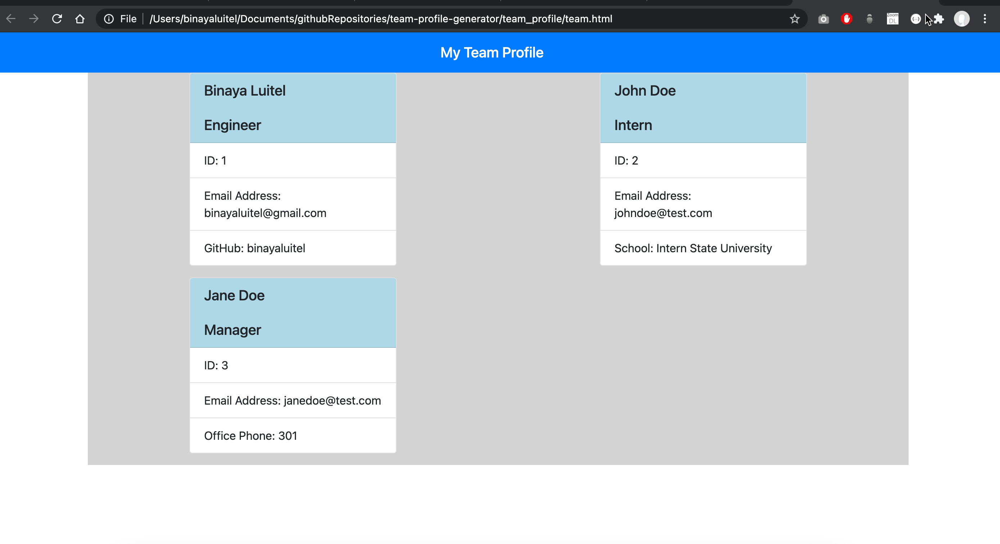
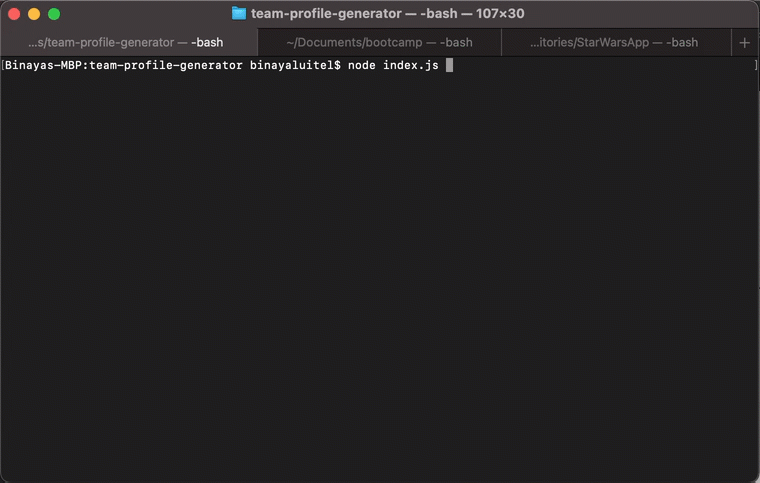

## Description 
   
This is a Node.js command-line application that takes in information about employees on a software engineering team, then generates an HTML webpage that displays summaries for each person. This application uses [Jest](https://www.npmjs.com/package/jest) for running the unit tests and [Inquirer](https://www.npmjs.com/package/inquirer) for collecting input from the user. 

 

  ## Table of Contents
  * [Installation](#installation)
  * [Usage](#usage)
  * [Contributing](#contributing)
  * [Tests](#tests)
  * [License](#license)
  
  ## Installation
    
  Navigate inside the folder and run `npm install`. This will install all the dependencies from package.json file.
  
  ## Usage 
  
  Run command `node index.js` and enter all the information. Please refer to the attached video for further instruction.
  
  
  
  ## Contributing
  
  Binaya Luitel
  
  ## Tests  
  
  Run command `npm test` to run all the jest tests.
  
  ## License
  
  MIT License
  
